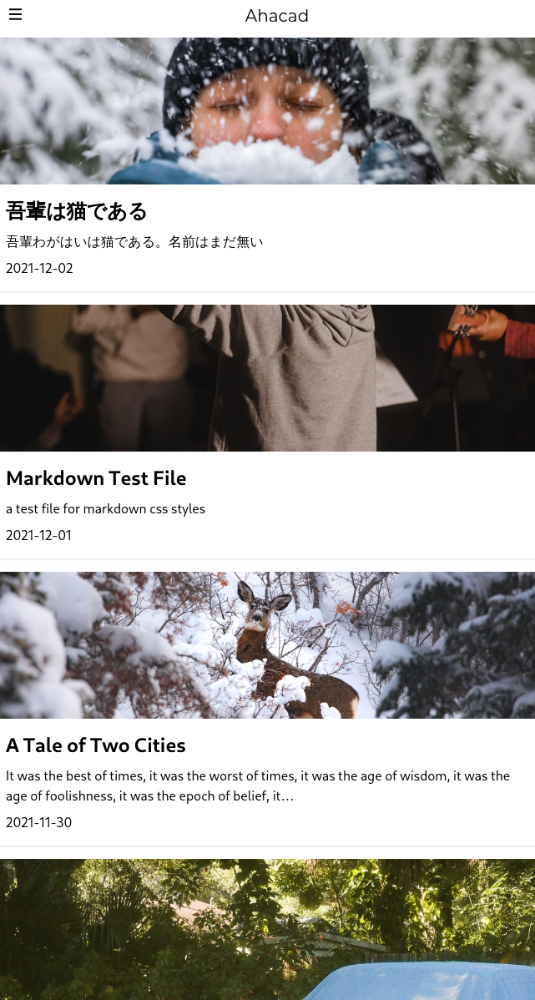

<p align="center">
  <a href="https://www.gatsbyjs.com/?utm_source=starter&utm_medium=readme&utm_campaign=minimal-starter">
    
  </a>
</p>
<h1 align="center">
  Gatsby theme journal
</h1>

Desktop:


Mobile: 



## Features

- 📝 write posts in markdown and get them published
- 🌈 tailwindcss easy-to-use stylesheets
- 📻 RSS support
- 🤔 support Google Analytics
- ⚡ fast loading time with Gatsby
- 🛠 add anything you want, with the Gatsby ecology and React

## ⚙️ Installation  

```
git clone https://github.com/Ahacad/gatsby-theme-journal
cd gatsby-theme-journal
yarn install # or npm i
yarn dev # and head to localhost:8000 to see the result
```

## 🧰 Customization

Change the followings in `gatsby-config.js`:

```
pathPrefix: "your github repo, or leave it empty if you don't need this",
siteMetaData: {
    siteUrl: "your site url",
    siteName: "your site name",
    sign: "your sign for the site"
}
```

## 💡 Inspirations

- [hexo-theme-journal](https://github.com/SumiMakito/hexo-theme-Journal)
