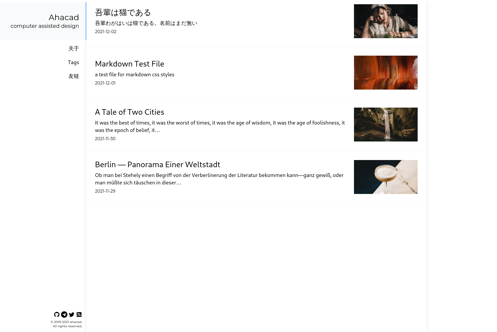

<p align="center">
  <a href="https://www.gatsbyjs.com/?utm_source=starter&utm_medium=readme&utm_campaign=minimal-starter">
    
  </a>
</p>
<h1 align="center">
  Gatsby theme journal
</h1>



## ⚙️ Installation  

```
git clone https://github.com/Ahacad/gatsby-theme-journal
cd gatsby-theme-journal
yarn install # or npm i
yarn dev # and head to localhost:8000 to see the result
```

## 💡 Inspirations

- [hexo-theme-journal](https://github.com/SumiMakito/hexo-theme-Journal)
